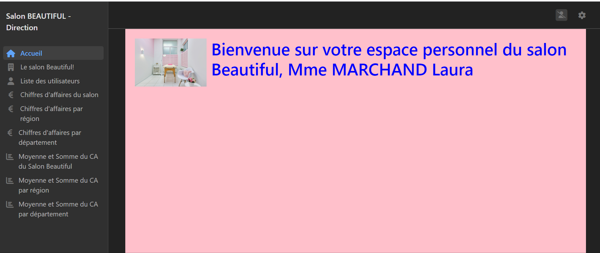
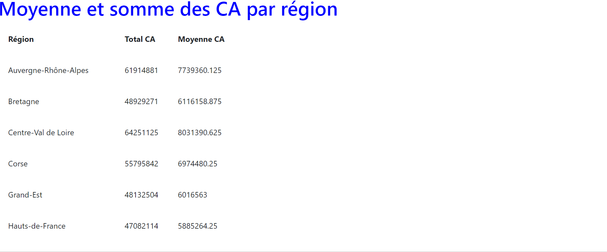

# salon_b

## Description
Mon projet symfony permet à la gérante et à l'administrateur de voir la liste des utilisateurs, le profil du salon, les chiffres d'affaires du salon
et de rajouter le mois précédent, les chiffres d'affaires par région et par département, les moyennes et sommes des chiffres d'affaires du salon, des concurrents
par département et région. Ces montants peuvent être modifiés et les calculs de moyennes et de sommes s'actualisent.

## Exigences
- PHP 8 ou supérieur
- Symfony 6 ou supérieur
- Composer

## Installation
1. Clonez ce dépôt sur votre machine locale :
   ```shell
   git clone https://github.com/wendy1976/salon_b.git
2.Accédez au répertoire du projet :
  cd salon_b
3. Installez les dépendances PHP en utilisant Composer :
  composer install
4.Configurez votre base de données dans le fichier .env et exécutez les migrations :
  php bin/console doctrine:migrations:migrate
5. Lancez le serveur de développement Symfony :
  symfony server:start
6.Accédez à l'application dans votre navigateur à l'adresse http://localhost:8000/accueil

## Structure et fonctionnalités générales
1.A partir de la page d'accueil:

  - lien vers le service d'administration (http://localhost:8000/admin)
  - lien vers l'espace personnel de la direction (http://localhost:8000/direction)
  - lien vers le formulaire d'inscription (http://localhost:8000/formutilisateur)


2.Service administration et espace de la direction:


  - profil du salon (avec ses champs:nom, adresse,date d'ouverture,nombre d'employés, nom et prénom du gérant)

  - liste des utilisateurs: avec possibilité de les éditer et modifier, en rajouter, en supprimer

  - les chiffres d'affaires mensuels du salon:avec possibilité de les éditer et modifier, en rajouter, en supprimer

  - les chiffres d'affaires mensuels par région:avec possibilité de les éditer et modifier, en rajouter, en supprimer, et un moteur de recherche pour sélectionner la région ou le mois que l'on souhaite afficher

- les chiffres d'affaires mensuels par département:avec possibilité de les éditer et modifier, en rajouter, en supprimer, et un moteur de recherche pour sélectionner le département ou le mois que l'on souhaite afficher

- la moyenne et la somme des chiffres d'affaires du salon: calculé automatiquement selon les modifications, suppressions, ou ajouts

- la moyenne et la somme des chiffres d'affaires par région: calculé automatiquement selon les modifications, suppressions, ou ajouts

- la moyenne et la somme des chiffres d'affaires par département: calculé automatiquement selon les modifications, suppressions, ou ajouts


3.le formulaire d'inscription, à partir de la page d'accueil ou: http://localhost:8000/formutilisateur
-  avec indication des types de caractères requis pour le mot de passe
-  confirmation de l'adresse Email
-  information si le mot de passe ne comprend pas les caractères requis
-  validation et envoi d'un message de confirmation "inscription réussie", et envoi d'un mail de confirmation
-  si la validation est ok: rajout dans la base de données
-
-

## Autres fonctionnalités (ok ou préparées en localhost):

- Envoi d'un mail de rappel à l'utilisateur concerné le 5 du mois, pour qu'il ajoute le CA du mois précédent dans son espace administratif, fichier : src/Command/EmailReminderCommand.php
- les mots de passe des utilisateurs sont chiffrés:config/packages/security.yaml, hachage des mots de passe:Symfony sélectionnera automatiquement le meilleur hachage disponible (bcrypt ou argon2i)
- authentification JWT, le controleur src/Controller/AuthController.php, et le bundle :config/packages/lexik_jwt_authentication.yaml (problème avec ma version)


